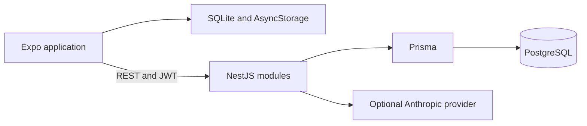

# IRON MIND AI

**A fitness application for planning workouts, recording progress and keeping training data in one place.**

React Native client · NestJS API · PostgreSQL · Local SQLite storage

[Mobile application](iron-mind-ai/mobile) · [Backend](iron-mind-ai/backend) · [Data model](iron-mind-ai/backend/prisma/schema.prisma)

## Overview

IRON MIND AI brings workout sessions, training programs, nutrition entries and body measurements into a mobile interface. The repository contains an Expo application and a modular NestJS backend, with separate flows for users, coaches and administrators.

This is a development project. It includes implemented application features and experimental modules; a public production deployment or app-store release is not documented here.

## Main features

- **Workout tracking:** record exercises, sets, repetitions, weight and perceived effort; finish sessions and review exercise history.
- **Training programs:** browse programs, manage program days and exercises, and schedule sessions.
- **Progress records:** nutrition logs, body measurements, progress photos and statistics screens.
- **Engagement:** achievements, workout summaries, reminders and animated interface components.
- **Account and role flows:** JWT authentication and server modules for user, coach and administrator operations.
- **Assistant integration:** an optional Anthropic provider for chat and coaching features, with fallback behavior when it is unavailable.

## Technology

- **Client:** TypeScript, React 19, React Native 0.81, Expo 54, React Navigation and Zustand.
- **Local data:** Expo SQLite repositories and AsyncStorage.
- **Interface:** React Native Reanimated, gradients, custom charts and reusable screen components.
- **API:** NestJS 11, Prisma 6, PostgreSQL, Passport/JWT and DTO validation.
- **AI provider:** Anthropic SDK configured on the backend only.

## Architecture



The mobile API client lives in `mobile/src/api/client.ts`. Domain-specific SQLite repositories live in `mobile/src/db`. The server separates authentication, programs, workouts, nutrition, measurements, statistics and coaching into NestJS modules.

## Run locally

Use Node.js and npm compatible with the Expo SDK declared in the mobile package. The backend needs a PostgreSQL instance and its own database. Android development requires an emulator or device; running an iOS simulator requires macOS.

### 1. Configure the backend

Create `iron-mind-ai/backend/.env` using your local database credentials and a unique JWT secret:

```dotenv
DATABASE_URL=postgresql://<db-user>:<db-password>@localhost:5432/<db-name>?schema=public
JWT_SECRET=<replace-with-a-random-secret-of-at-least-32-characters>
JWT_EXPIRES_IN=30d
PORT=4001
ANTHROPIC_API_KEY=
```

Leaving `ANTHROPIC_API_KEY` empty disables the external provider. `ANTHROPIC_MODEL` is also supported if a model override is needed. Keep credentials in local environment files.

From the repository root:

```sh
cd iron-mind-ai/backend
npm install
npm run db:generate
npm run db:migrate
npm run db:seed
npm run start:dev
```

Use a dedicated development database: migrations change its schema and the seed script creates demonstration records. The API listens on port `4001` by default.

### 2. Configure and start the client

In `iron-mind-ai/mobile/.env`, set the address reachable from the client:

```dotenv
EXPO_PUBLIC_API_URL=http://localhost:4001
```

Use `http://10.0.2.2:4001` for the standard Android emulator, or your development computer's LAN address for a physical device. These public Expo variables must never contain secrets.

In another terminal, from the repository root:

```sh
cd iron-mind-ai/mobile
npm install
npm run start
```

The package also provides `npm run android`, `npm run ios` and `npm run web`. Native capabilities and web behavior should be checked on the intended target platform.

## Repository structure

```text
iron-mind-ai/
  backend/
    prisma/           Database schema, migrations and seed data
    src/              NestJS domain modules and API controllers
    test/             Backend test configuration
  mobile/
    src/api/          HTTP client and endpoint helpers
    src/db/           SQLite schema and repositories
    src/screens/      Application screens
    src/store/        Zustand stores
    src/components/   Interface, animation and chart components
    assets/           Application assets
  ai_trainer_refs/     Design reference material
```

## Current boundaries

- The history-based load recommendations in `backend/src/ai/ai.service.ts` use deterministic rules. They should not be described as model-generated recommendations.
- AI availability depends on backend configuration. A missing or failed external provider can use fallback behavior.
- The reference images under `ai_trainer_refs` are design material, not evidence of a deployed application.
- Local and server data paths exist, but comprehensive cross-device synchronization and production readiness are not established by this README.

## Development commands

From `iron-mind-ai/backend`:

```sh
npm run build
npm run test
npm run test:e2e
```

These are the scripts provided by the project. This documentation does not assert that a build, test suite or device verification has passed.
